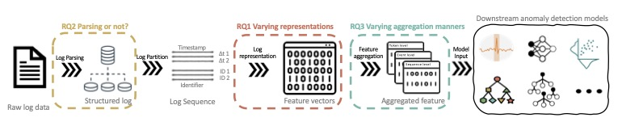

# Log Representation - Supplimental Materials
The repository contains the detailed results and replication package for the paper "On the Effectiveness of Log Representation for Automated Log Analysis".


## Introduction

The overall framework of our experiments and our research questions:



We organize the this repository into following folders:

1. 'models' contains our studied anomaly detection models, both traditional and deep-learning models.
    - Traditional models (i.e., SVM, decision tree, logistic regression, random forest)
    - Deep-learning models (i.e., MLP, CNN, LSTM)
2. 'logrep' contains the codes we used to generated all the studied log representations.
    - Feature generation
    - Feature aggregation (from event-level to sequence-level)
3. 'results' contains the experimental results which are not listed on the paper as the space limit.
    - Results for [RQ1](https://github.com/logRepresentationResearch/LogRepForLogAnalysis/blob/main/results/RQ1.md), [RQ2](https://github.com/logRepresentationResearch/LogRepForLogAnalysis/blob/main/results/RQ2.md), [RQ3](https://github.com/logRepresentationResearch/LogRepForLogAnalysis/blob/main/results/RQ3.md)

## Dependencies
We recommend using an Anaconda environment with Python version 3.9, and following Python requirement should be met.

* Numpy 1.20.3
* PyTorch 1.10.1
* Sklearn 0.24.2

## Dataset

### Source
We use HDFS and BGL datasets. 
Datasets are accessed from [LogHub](https://github.com/logpai/loghub) project.
(We do not provide generated log representations as they are in huge size. Please generate them with our codes provided.)

### Extra regular expression parsed to the Drain parser to process BGL dataset

We used Drain to parse the studied datasets. We adopted the default parameters from the following paper for parsing.

```
Pinjia He, Jieming Zhu, Zibin Zheng, and Michael R. Lyu. Drain: An Online Log Parsing Approach with Fixed Depth Tree, Proceedings of the 24th International Conference on Web Services (ICWS), 2017.
```

However, Drain parser generated too much templates with the default setting due to the failure of spotting some dynamic fields. We passed the following regular expression to reduce the amount.

```
regex      = [r'core\.\d+',
              r'(?<=r)\d{1,2}',
              r'(?<=fpr)\d{1,2}',
              r'(0x)?[0-9a-fA-F]{8}',
              r'(?<=\.\.)0[xX][0-9a-fA-F]+',
              r'(?<=\.\.)\d+(?!x)',
              r'\d+(?=:)',
              r'^\d+$',  #only numbers
              r'(?<=\=)\d+(?!x)',
              r'(?<=\=)0[xX][0-9a-fA-F]+',
              r'(?<=\ )[A-Z][\+|\-](?= |$)',
              r'(?<=:\ )[A-Z](?= |$)',
              r'(?<=\ [A-Z]\ )[A-Z](?= |$)'
              ]
```


## Experiments

The general process to replicate our results is:

1. Generate structured parsed dataset using [loglizer](https://github.com/logpai/loglizer) with Drain parser into JSON format.
2. Split the dataset into training and testing set and save as NPZ format, with `x_train`, `y_train`, `x_test`, `y_test`.
3. Generate selected log representations with corresponding codes within the `logrep` folder, and generates representations and save as NPY or NPZ format.
4. If the studied technique generates event-level representations, use the `aggregation.py` in the `logrep` folder to merge them into sequence-level for the models that demand sequence-level input.
5. Load generated representations and corresponding labels, and run the models within the `models` folder to get the results.

* Sample parsed data and splitted data are provided in `samples` folder.


## Network details for CNN and LSTM

### CNN
|    Layer    |                          Parameters                          |      Output      |
| :---------: | :----------------------------------------------------------: | :--------------: |
|  __Input__  |                 _win\_size * Embeddin\_size_                 |       N/A        |
|   __FC__    |                    _Embedding\_size * 50_                    | _Win\_size * 50_ |
| __Conv 1__  | _kernel_size=[3, 50], stride=[1, 1], padding=valid, MaxPool2D:[𝑤𝑖𝑛_𝑠𝑖𝑧𝑒 − 3, 1], LeakyReLU_ |   _50 * 1 * 1_   |
| __Conv 2__  | _kernel\_size=[4, 50], stride=[1, 1], padding=valid, MaxPool2D: [𝑤𝑖𝑛_𝑠𝑖𝑧𝑒 − 3, 1], LeakyReLU_ |   _50 * 1 * 1_   |
| __Conv 3__  | _kernel\_size=[5, 50], stride=[1, 1], padding=valid, MaxPool2D:[𝑤𝑖𝑛_𝑠𝑖𝑧𝑒 − 4, 1], LeakyReLU_ |   _50 * 1 * 1_   |
| __Concat__  | _Concatenate feature maps of Conv1, Conv2, Conv3, Dropout(0.5)_ |  _150 * 1 * 1_   |
|   __FC__    |                         _[150 * 2]_                          |       $2$        |
| __Output__ |                           _Softmax_                           |                  |


### LSTM

|   Layer    |           Parameters            |        Output         |
| :--------: | :-----------------------------: | :-------------------: |
| __Input__  | _[win\_size * Embedding\_size]_ |         _N/A_         |
|  __LSTM__  |        _Hidden\_dim = 8_        | _Embedding\_size * 8_ |
|   __FC__   |            _[8 * 2]_            |          _2_          |
| __Output__ |            _Softmax_            |                       |


## Acknowledgements

Our implimentation bases on or contains many references to following repositories:

* [logparser](https://github.com/logpai/logparser)
* [loglizer](https://github.com/logpai/loglizer)
* [deep-loglizer](https://github.com/logpai/deep-loglizer)
* [ScottKnottESD](https://github.com/klainfo/ScottKnottESD)
* [clip(bert)-as-service](https://github.com/jina-ai/clip-as-service)
* [imbalanced-dataset-sampler](https://github.com/ufoym/imbalanced-dataset-sampler)

## Citing & Contacts

Please cite our work if you find it helpful to your research.
```
To be available after the blinded review.
```


